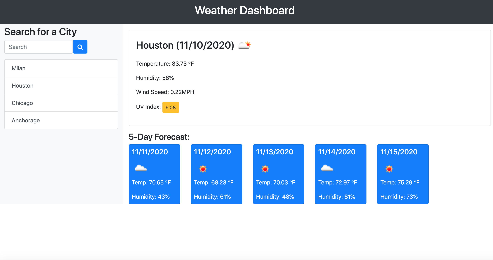

## Weather Dashboard ##

This application is meant to display the weather of any given city, the information drawn from the OpenWeather API. The search history is logged in local storage and a link to the weather in that city is created underneath the search bar. The information provided is temperature, humidity, wind speed and UV index, as well as a five day forecast for the given city. 

Technologies used: HTML, Javascript

Link to deployed site: https://nmichel123.github.io/Weather-Dashboard/

