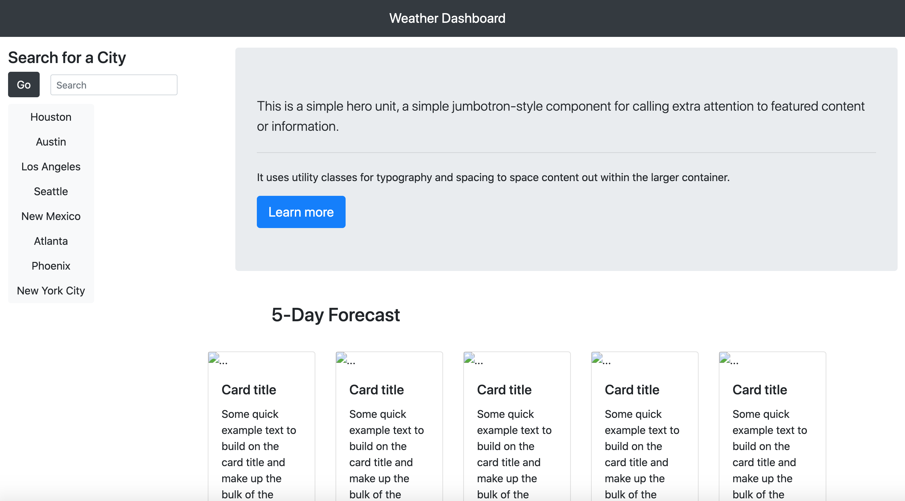

## Weather Dashboard ##

This application is meant to display the weather of any given city, the information drawn from an API. It is meant to display the current weather conditions in a large block as well as a five day forecast for the same location in the sections below the current forecast. At the time of upload, the site does not function, as the javascript logic meant to draw from the api does not work. 

